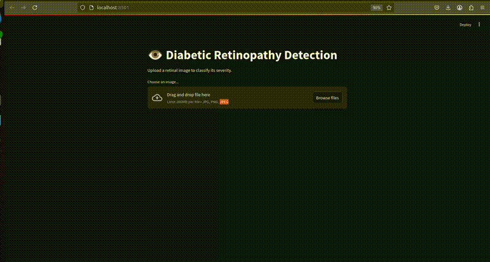
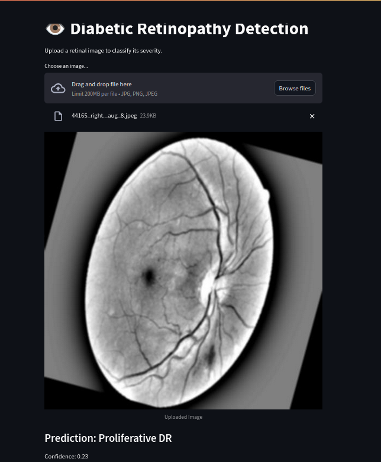

## 📌 Overview  
This project was developed for the **Infyma AI Hackathon 2025**. It focuses on detecting **Diabetic Retinopathy (DR)** from retinal images using **Vision Transformers (ViT)**. The model classifies retinal images into different severity levels, aiding in **early diagnosis and treatment**.  

---

## 📂 Dataset  
- **Source**: [Diabetic Retinopathy Balanced Dataset (Kaggle)](https://www.kaggle.com/datasets/kushagratandon12/diabetic-retinopathy-balanced/data)  
- **Categories**:  
  - 🟢 **0**: No DR (Healthy)  
  - 🟡 **1**: Mild DR  
  - 🟠 **2**: Moderate DR  
  - 🔴 **3**: Severe DR  
  - 🔥 **4**: Proliferative DR  
- **Format**: JPEG/PNG images with structured CSV metadata.  

---

## 📁 File Structure 
├── team_name/ │ ├── model/ │ │ ├── diabetic_retinopathy_transformer_balanced.h5 # Trained model │ ├── notebooks/ │ │ ├── model_training.ipynb # Jupyter Notebook
│ ├── report.pdf # Explanation of approach & results
│ ├── README.md # Project documentation
│ ├── requirements.txt # Dependencies
## 🛠 Installation  
1. **Clone the repository**:  
   ```bash
   git clone https://github.com/Tuba-Islam/InfymaProject.git
   cd InfymaProject
2-Install dependencies:

    pip install -r requirements.txt

3-Download and place the dataset in the data/ directory.
📊 Model Pipeline
1️⃣ Data Processing & Augmentation

✅ Preprocessing: Resizing images to 224x224 pixels
✅ Augmentation: Rotation, Zoom, Horizontal Flip
✅ Balanced Training Set: 50% of images per class selected
2️⃣ Vision Transformer (ViT) Model

    Patch Size: 16x16
    Transformer Layers: 8
    Multi-Head Attention Heads: 8
    MLP Layers: [128, 64]
    Final Activation: Softmax (5-class classification)

3️⃣ Model Training

To train the model, run:

jupyter notebook notebooks/model_training.ipynb

    Optimizer: Adam (with learning rate scheduling)
    Loss Function: Sparse Categorical Crossentropy
    Epochs: 20
    Batch Size: 32

📊 Evaluation & Explainability

🔹 Overall Accuracy: 35%
🔹 Best Performance: No DR (72% recall), Proliferative DR (68% recall)
🔹 Weakest Classes: Moderate & Severe DR (low recall, often misclassified)
🔹 Precision, Recall, and F1-score:
Class	Precision	Recall	F1-score	Support
No DR (Healthy)	0.44	0.72	0.54	1000
Mild DR	0.31	0.17	0.22	971
Moderate DR	0.21	0.09	0.12	1000
Severe DR	0.32	0.08	0.13	1000
Proliferative DR	0.32	0.68	0.44	1000

📌 Model Explainability:

    Uses Grad-CAM to visualize affected areas in retinal images.
    Computational efficiency optimized using model quantization.

🏆 Evaluation Criteria

Your submission is judged based on:
✔️ 40% Accuracy & Performance: Model precision & recall
✔️ 20% Explainability: Interpretation of predictions
✔️ 20% Computational Efficiency: Speed & optimization
✔️ 20% Innovation: Hybrid models, novel architectures
🚀 Deployment

The trained model can be deployed for real-time predictions.
🔹 Steps to Deploy (Streamlit)

    Install dependencies:

pip install streamlit tensorflow numpy opencv-python pillow

Run the web app:

    streamlit run app.py

    Upload a retinal image, and the app will classify its severity.


### **🖼️ Sample Output (App Working)**
#### **Demo GIF:**


#### **Model Output Example:**



Model Output Example:

📌 Upload a retinal image to get a prediction!
📜 Hackathon Rules & Guidelines

✅ Allowed Frameworks: TensorFlow, PyTorch, OpenCV, FastAI, Scikit-Learn.
✅ Submission Format:

    Jupyter Notebook (.ipynb)
    Model Weights (.h5 or .pt)
    Short Report (report.pdf)
    ✅ Plagiarism: Unauthorized use of existing solutions will lead to disqualification.

📤 Submission Instructions

    Push your project to GitHub.
    Submit your GitHub repository link as per hackathon guidelines.
    Ensure the following files are included:
        ✅ model_training.ipynb (Notebook)
        ✅ trained_model.h5 (Saved model)
        ✅ README.md (Documentation)
        ✅ requirements.txt (Dependencies)
        ✅ report.pdf (Explaining approach)

📜 License

This project is open-source and available under the MIT License.

This project is open-source and available under the MIT License.
